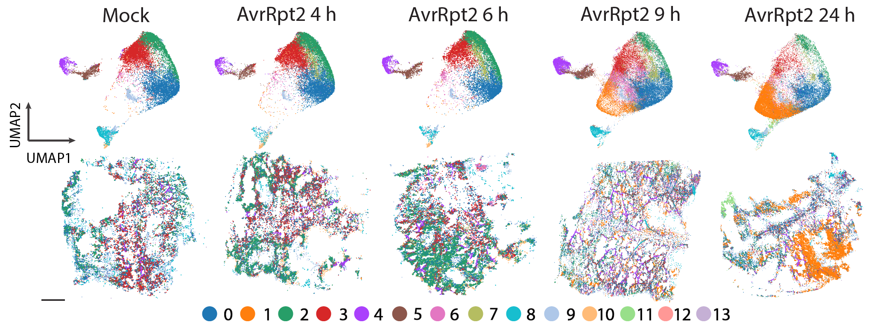

# Time-resolved single-cell and spatial gene regulatory atlas of plants under pathogen attack


> [!NOTE]
> In this repository, we show how to reproduce the figures from our 2023 manuscript[^1]. Additionally, we provide our data processing pipelines to create fully-processed Anndata and Seurat objects containing all of the single-cell and spatial data used to construct figures.

## Table of Contents

- [Abstract](#abstract)
- [Setup](#setup)
- [Download](#download)
- [Preprocessing](#preprocessing)
- [Figures](#figures)
- [Submitting changes](#submittingchanges)

## Abstract
Plants lack specialized and mobile immune cells, requiring any cells–regardless of cell type–that encounter pathogens to mount immune responses and communicate with surrounding cells for successful defense. However, the diversity, spatial organization, and function of cellular immune states in pathogen-infected plants are scarcely understood. Here, we comprehensively identify cell states in Arabidopsis thaliana leaves infected by immune-triggering and -suppressive bacterial pathogens by integrating time-resolved single-cell transcriptomics, epigenomics, and spatial transcriptomics. We reveal cell state-specific gene regulatory logic involving transcription factors (TFs), putative cis-regulatory elements, and target genes associated with disease and immunity. We identify a rare cell population that emerges at the nexus of immune-active hotspots designated as the Primary IMmunE Responder (PRIMER) cells. PRIMER cells show non-canonical immune signatures, exemplified by the expression of a previously uncharacterized TF, GT-3a, and high accessibility of this TF in the genome. We demonstrate that GT-3a negatively regulates plant immune responses against bacterial pathogens. PRIMER cells are surrounded by cells that activate genes for long-distance cell-to-cell immune signaling, suggesting potential interactions between these cell states for propagating immune responses across the leaf. Our molecularly defined spatiotemporal atlas serves as a discovery platform for immune cell states with functional and regulatory insights.

## Setup

This repository contains a `devcontainer` to allow to run the scripts in a reproducible manner. Please see the [documentation](https://code.visualstudio.com/docs/devcontainers/containers) for further information on how to use devcontainers.

## Spatial Data Download

The data needed to reproduce our results is available for download [here](http://neomorph.salk.edu/download/Nobori_etal_merfish).
To reproduce the main figures, the following files in the `data` directory are needed. 

> [!IMPORTANT]
> A script to download the input data to the MERFISH pipeline is included [here](data_download_spatial.py). To download smFISH images of EDS16, please visit [this link](http://neomorph.salk.edu/download/Nobori_etal_merfish/smFISH). We have not included these images in the download script. 

```text
data
├── segmentations
│   ├── kt56
│       ├── segmentation_kt_cell_stats.csv
│       └── segmentation_kt_counts.tsv
│   ├── mock
│       ├── segmentation_mock_cell_stats.csv
│       └── segmentation_mock_counts.tsv
│   ├── 4hr_avr
│       ├── segmentation_4hr_avr_cell_stats.csv
│       └── segmentation_4hr_avr_counts.tsv
│   ├── 6hr_avr
│       ├── segmentation_6hr_avr_cell_stats.csv
│       └── segmentation_6hr_avr_counts.tsv
│   ├── 9hr_avr
│       ├── segmentation_9hr_avr_cell_stats.csv
│       └── segmentation_9hr_avr_counts.tsv
│   ├── avrrpt24
│       ├── segmentation2_cell_stats.csv
│       └── segmentation2_counts.tsv
├── useful_files
│   └── geneID_to_geneName_MERSCOPE_panel1.txt
├── AvrRpt2_alone.rds
├── AvrRpt2_alone2.rds
└── DC3000_alone.rds
```

## Spatial Preprocessing

To get the segmentation files, prior to this pipeline we ran Baysor on the transcript output files from the MERSCOPE with the following command: `baysor run -s 250 -x global_x -y global_y -z global_z -o segmentation_'+os.path.basename(self.output_folder)+'.csv -g gene --num-cells-init '+str(int(num_cells_total*1.1))+' --n-clusters 1 --force-2d -i 1 -c baysor_avr_fullrun_config.toml detected_transcripts.csv`

where num_cells_total is an estimate of the total number of cells in the given tissue. You can find the baysor_avr_fullrun_config.toml file [here](baysor_avr_fullrun_config.toml). We provide the segmentation outputs at our download link. 

We have a spatial processing pipeline with several ordered Jupyter notebooks to create the processed objects needed for figure creation. 

1. Processing of MERSCOPE Arabidopsis time course after infection.
   [MERSCOPE processing](/processing_pipelines/MERFISH_processing)

## snMultiome Data Download

The data needed to reproduce our results is available for download [here](http://neomorph.salk.edu/download/Nobori_etal_merfish).
To reproduce the main figures, the following files in the `data` directory are needed. 

> [!IMPORTANT]
> A script to download the input data to the pipeline is included [here](data_download_snMultiome.py).

```text
data

```


## snMultiome Data Download

1. snMultiome data processing of Arabidopsis time course after infection replicate 1.
   [snMultiome rep 1 processing](/processing_pipelines/snMultiome_replicate_1_processing)
2. snMultiome data processing of Arabidopsis time course after infection replicate 2.
   [snMultiome rep 2 processing](/processing_pipelines/snMultiome_replicate_2_processing)
   
## Figures

This section contains the scripts to reproduce the figures in the paper.

### MERFISH Figure Script Links

| Figure | Link                                                  |
|--------|-------------------------------------------------------|
| smFISH EDS16     | [Notebook](/processing_pipelines/smFISH_processing/01_quantify_sid_expression.ipynb)         |
| bacterial analysis     | [Notebook](/figures/bacteria/bacteria.ipynb) |
| Quality control metrics     | [Notebook](/figures/qc_metrics/qc_metrics.ipynb)     |
| Joint embedding and spatial plotting  | [Notebook](/figures/joint_embedding_and_spatial_clusters/joint_embedding_and_spatial_clusters.ipynb)    |
| Celltype assignments accuracy  | [Notebook](/figures/celltype_assignment_accuracy/celltype_assignments.ipynb)     |
| snMultiome pseudotime and clusters   | [Notebook](/figures/seq_clusters_and_pseudotime_figures/seq_clusters_and_pseudotime_figures.ipynb)    |

### snMultiome Figure Script Links

| Figure                 | Link                                                |
|------------------------|-----------------------------------------------------|
| 2a <br /> 2b <br /> 2c | [Notebook](/Figure_2/2abc.ipynb) |
| 2d                     | [Notebook](/Figure_2/2d.ipynb)                   |
| 2e <br /> 2f           | [Notebook](/Figure_2/2ef.ipynb)   |
| 2g                     | [Notebook](/Figure_2/2g.ipynb)  |
| 2h <br /> 2i           | [Notebook](/Figure_2/2hi.ipynb)       |
| 2j                     | [Notebook](/Figure_2/2j.ipynb)         |

## Submitting changes

> [!IMPORTANT]
> Make sure to run `pre-commit run --all-files` before commiting

## Contact

- Tatsuya Nobori: :envelope: tnobori@salk.edu
- Alexander Monell: :envelope: amonell@ucsd.edu
- Joe Ecker: :envelope: ecker@salk.edu

[^1]: https://www.biorxiv.org/content/10.1101/2023.04.10.536170v1
